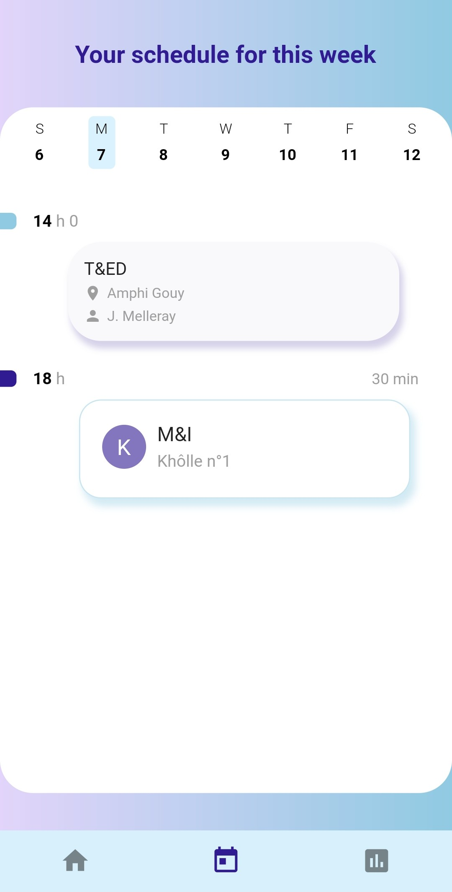
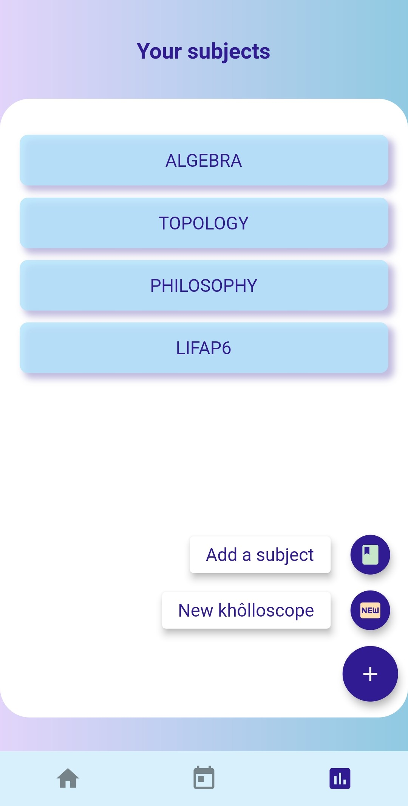
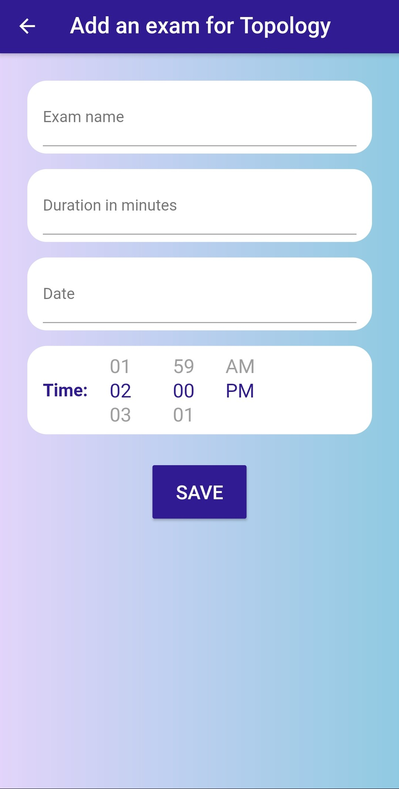

# Flutter Organizing App : OrganiZer

A Flutter app designed to create a khôlloscope(used in French preparatory schools to organize a 
set of oral exams for each subject) and handle college exams.

## Features
- [x] Creates a khôlloscope according to a number of weeks, a beginning date and a list of subjects
- [x] displays next three exams
- [ ] displays next two classes (displays dummy data for the moment)
- [x] weekly screen where is displayed corresponding daily exams (selectable day)
- [x] displays list of subjects with links to specific details for each of them
- [x] displays subject details (completion rate, average grade, list of exams with names, dates and grades)
- [x] possible to add exams, subjects and create another khôlloscope (with already entered subjects(mandatory) and new ones)

## ScreenShots
 
 

 
 

  

## Plugins and Flutter packages
| Name | Usage |
|------|-------|
|[**sqflite**](https://pub.dev/packages/sqflite)| stores exams and subjects in database |
|[**percent_indicator**](https://pub.dev/packages/percent_indicator)| visualisation of a subject's exams completion rate |
|[**flutter_time_picker_spinner**](https://pub.dev/packages/flutter_time_picker_spinner)| used to pick the time of an exam |
|[**shared_preferences**](https://pub.dev/packages/shared_preferences)| stores if the user has already opened the app |
[**after_layout**](https://pub.dev/packages/after_layout)| checks for above preference and shows the corresponding screen after the first layout of the app has been shown |

## Code organization
- Database: contains the database providers for Exam and Subject
- Models: Exam, Lesson (with dummy data), Plan and Subject class declarations
- Screens: contains all screens and forms
- Forms: Subject, Exam and Plan forms
- Widgets: the splash screen 

## Author
**Lou Cherensac** 